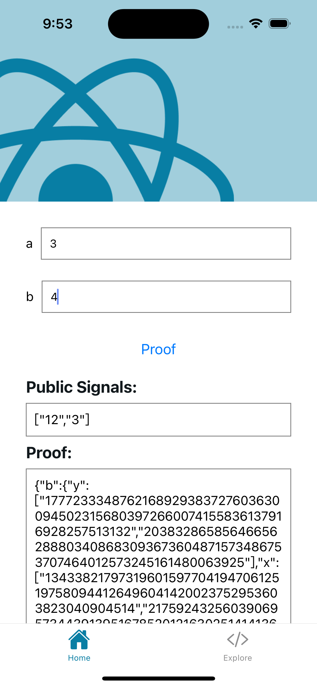
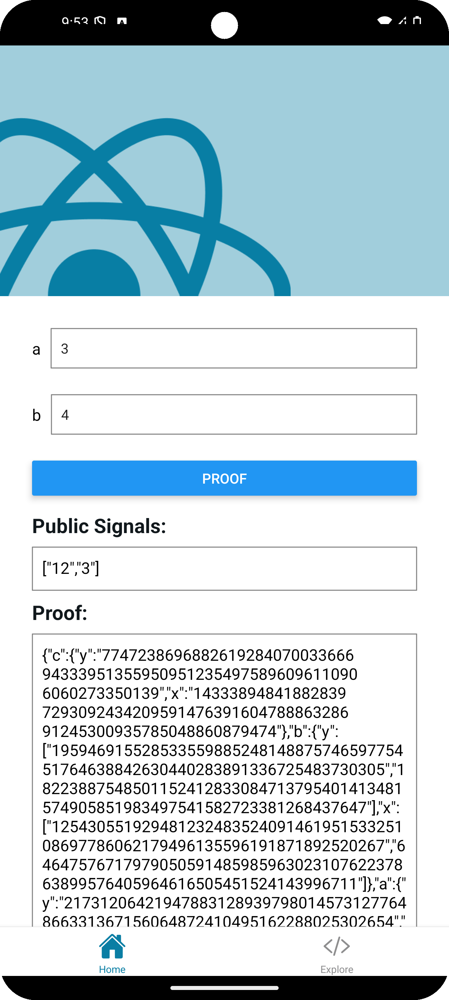
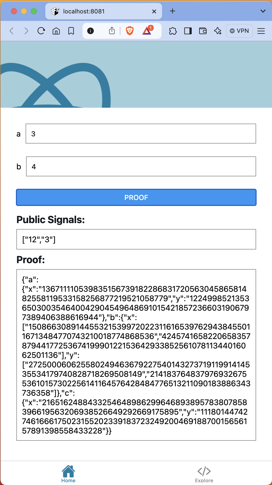

# Mopro React Native App with Expo framework

This is a sample [Expo](https://expo.dev) app that demonstrates how mopro can be used to prove a `multiplier2` circuit.

Learn more about Mopro: https://zkmopro.org.

## Get started

### 1. Install dependencies

```bash
npm install
```

### 2. Start the app

-   setup the `ANDROID_HOME` environment

    ```bash
    export ANDROID_HOME=~/Library/Android/sdk
    ```

    start an android emulator/device

    ```bash
    npm run android
    ```

-   start an iOS simulator

    ```bash
    npm run ios
    ```

    start an iOS device

    ```bash
    npm run ios:device
    ```

-   start a web app

    ```bash
    npm run web
    ```

### 3. Update Mopro Bindings

-   Get `MoproiOSBindings` and `MoproAndroidBindings` through [Rust Setup](https://zkmopro.org/docs/getting-started/rust-setup)
-   Update `modules/mopro/ios/MoproiOSBinding` with `MoproiOSBindings`

-   Copy the `MoproAndroidBindings/jniLibs` directory to `modules/mopro/android/src/main/jniLibs`. <br/>
    And copy `MoproAndroidBindings/uniffi` directory to `modules/mopro/android/src/main/java/uniffi`. <br/>

### 4. Define React Native Module

-   Define React Native's module APIs to pass messages between React Native and your desired platforms.
    -   **iOS:**
        -   [`modules/mopro/ios/MoproModule.swift`](modules/mopro/ios/MoproModule.swift)
    -   **Android**
        -   [`modules/mopro/android/src/main/java/expo/modules/mopro/MoproModule.kt`](modules/mopro/android/src/main/java/expo/modules/mopro/MoproModule.kt)
    -   **Browser**
        -   [`modules/mopro/src/MoproModule.web.ts`](modules/mopro/src/MoproModule.web.ts)
    -   **React Native**
        -   [`modules/mopro/index.ts`](modules/mopro/index.ts)

### 5. Use the React Native Module

-   For example, in [`app/(tabs)/index.tsx`](<app/(tabs)/index.tsx>)

    ```ts
    import {
        generateCircomProof,
        verifyCircomProof,
        CircomProofLib,
        ProofLibOption,
    } from "@/modules/mopro";

    const proofLib: CircomProofLib = {
        proofLib: ProofLibOption.Arkworks,
    };
    const circuitInputs = {
        a: ["3"],
        b: ["5"],
    };

    const res: CircomProofResult = await generateCircomProof(
        zkeyPath.replace("file://", ""),
        JSON.stringify(circuitInputs),
        proofLib
    );

    const valid = await verifyCircomProof(
        zkeyPath.replace("file://", ""),
        res,
        proofLib
    );
    ```

## Screenshots

### iOS



### Android



### Web


